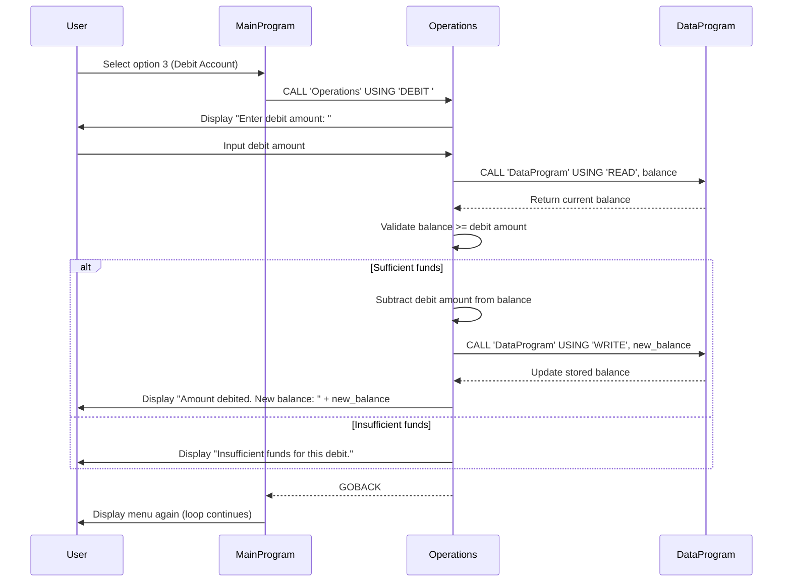

# COBOL Student Account Management System

This project implements a simple account management system for student accounts using COBOL programming language.

## Overview

The system provides basic banking operations for student accounts, including viewing balance, crediting funds, and debiting funds with balance validation.

## COBOL Files

### data.cob
**Purpose**: Handles data storage and retrieval operations for account balance.

**Key Functions**:
- Stores the account balance in working storage (initialized to $1000.00)
- Provides read/write operations through linkage section parameters
- Supports 'READ' operation to retrieve current balance
- Supports 'WRITE' operation to update stored balance

**Business Rules**:
- Initial account balance is set to $1000.00 for all student accounts

### main.cob
**Purpose**: Main program entry point providing a menu-driven user interface.

**Key Functions**:
- Displays interactive menu with account management options
- Handles user input for operation selection
- Calls appropriate operations based on user choice
- Manages program flow and exit conditions

**Menu Options**:
1. View Balance - Displays current account balance
2. Credit Account - Adds funds to the account
3. Debit Account - Subtracts funds from the account (with validation)
4. Exit - Terminates the program

### operations.cob
**Purpose**: Implements core business logic for account operations.

**Key Functions**:
- **TOTAL**: Retrieves and displays current account balance
- **CREDIT**: Prompts for credit amount, adds to balance, displays new balance
- **DEBIT**: Prompts for debit amount, validates sufficient funds, subtracts from balance

**Business Rules**:
- Debit operations require sufficient account balance
- Insufficient funds prevent debit transactions and display error message
- All operations update the persistent balance through data.cob
- Credit amounts can be any positive value
- Debit amounts must be positive and not exceed current balance

## System Architecture

The system follows a modular design with three separate programs:
- `main.cob` - User interface and program control
- `operations.cob` - Business logic implementation
- `data.cob` - Data persistence layer

Programs communicate through CALL statements and linkage sections, maintaining separation of concerns.

## Data Flow Sequence Diagram

The following sequence diagram illustrates the data flow for a debit operation (option 3), showing how data moves between the user, main program, operations module, and data storage:

## Usage

Compile and run the main program to start the account management system. The system will present a menu for performing account operations on a student account with an initial balance of $1000.00.